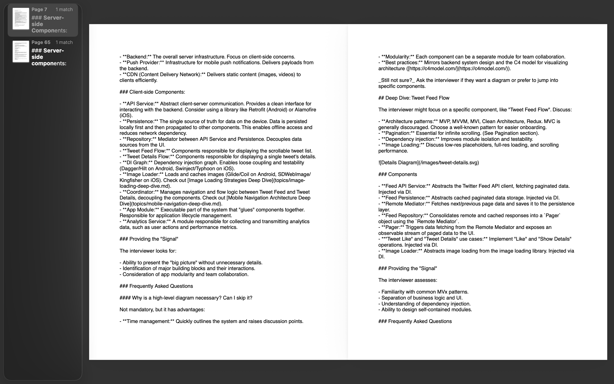
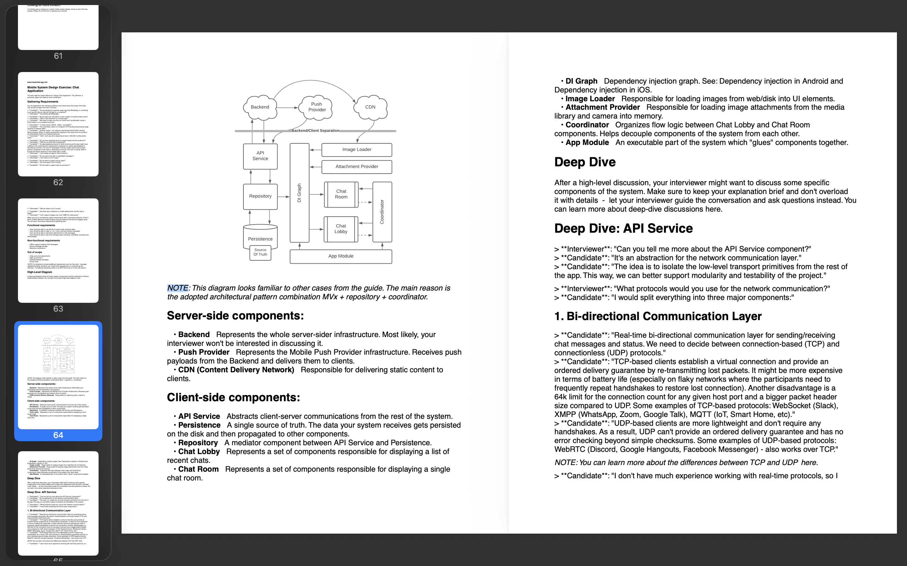

# GitRepoToPDF

GitRepoToPDF is a versatile tool designed to seamlessly transform GitHub repositories into well-formatted, visually engaging, and easy-to-navigate PDF files. 

> **Acknowledgments & Note:**  
> This project is a heavily enhanced and rebranded fork of the original [repo2pdf](https://github.com/BankkRoll/repo2pdf) by BankkRoll.  
> **If you are looking to install the original via NPM or use the web application, please run `npx repo2pdf` or visit [https://repo2pdf.site](https://repo2pdf.site).** GitRepoToPDF is currently designed to be run from source locally.

---

## ✨ What's New in GitRepoToPDF? (Differences from Original)

This fork introduces major visual and document-rendering improvements that are not present in the original `repo2pdf`:

### Visual Comparison 

Here is a look at what the generated PDFs look like when compared side-by-side. 
When prompted, remember to select **"Format Markdown files"**!

| Original `repo2pdf` Output | `GitRepoToPDF` Output |
|:---:|:---:|
|  |  |

- **🖼️ Full Vector & Raster Image Support:** Beautifully parses and renders inline Markdown images (like `.svg`, `.png`, `.jpg`) right alongside your documentation text instead of converting them to raw Base64 strings.
- **📝 Native Markdown Formatting:** Replaces raw Markdown code blocks (`##`, `**`, etc.) with actual stylized fonts (Bold, Italics, Lists, and Headings) for a true "reading" experience.
- **📊 Human-Readable Tables:** Markdown tables are no longer brutally cut off by page limits. They are parsed into clean, readable text layouts.
- **📐 Smart Rendering & Pagination:** Calculates dynamic image heights to automatically add page breaks, completely preventing text from overlapping with large images.

---

## Installation and Usage

Since this fork is not yet published to NPM, you can run it by cloning the repository locally.

1. **Clone the repository:**
   ```shell
   git clone https://github.com/your-username/GitRepoToPDF.git
   cd GitRepoToPDF
   ```

2. **Install the dependencies:**
   ```shell
   npm install
   ```

3. **Build the script:**
   ```shell
   npm run build
   ```

4. **Run the script:**
   ```shell
   npm start
   ```

5. **Follow the Prompts:**
   The script will ask you for details like taking files from a local directory or cloning a GitHub URL. 
   **Make sure to select the new feature:** `"Format Markdown files"`!

*(If you instead want to use the original unmodified version directly via NPM without cloning, simply run `npx repo2pdf`).*

---

## Configuration

Like the original, GitRepoToPDF automatically ignores certain binary files. However, we added a new `includedExtensions` property to `repo2pdf.ignore` that dictates which image extensions can override exclusions to be printed as images!

**Example `repo2pdf.ignore` in your target repository:**
```json
{
  "ignoredFiles": ["tsconfig.json", "dist", "node_modules"],
  "ignoredExtensions": [".raw"],
  "includedExtensions": [".png", ".jpg", ".jpeg", ".svg"]
}
```

---

## License

This project is open-source software licensed under the MIT License. 
Copyright (c) 2026 Kevin Malik. 
Original Copyright (c) 2023 BankkRoll.

See the `LICENSE.md` file for more information.
